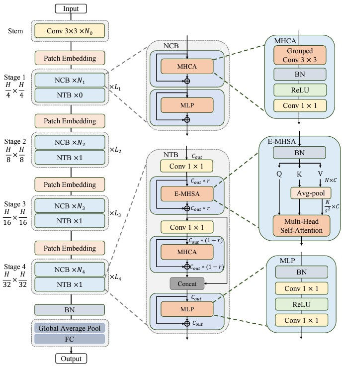

# Next-ViT

Unofficial PyTorch implementation of Next-ViT based on paper [Next-ViT: Next Generation Vision Transformer for Efficient Deployment in Realistic Industrial Scenarios](https://arxiv.org/abs/2207.05501).




## Usage :
```python
import torch
import model

net = model.NextViT_S()
inputs = torch.randn(1, 3, 224, 224)
result = net(x, inputs)
print(result.shape)
```

## Citation :
```
@misc{li2022NextViT,
    title={Next-ViT: Next Generation Vision Transformer for Efficient Deployment in Realistic Industrial Scenarios},
    author={Jiashi Li, Xin Xia, Wei Li, Huixia Li, Xing Wang, Xuefeng Xiao, Rui Wang, Min Zheng, Xin Pan},
    year={2022},
    eprint={2207.05501},
    archivePrefix={arXiv},
    primaryClass={cs.CV}
}
```


### If this implement have any problem please let me know, thank you.